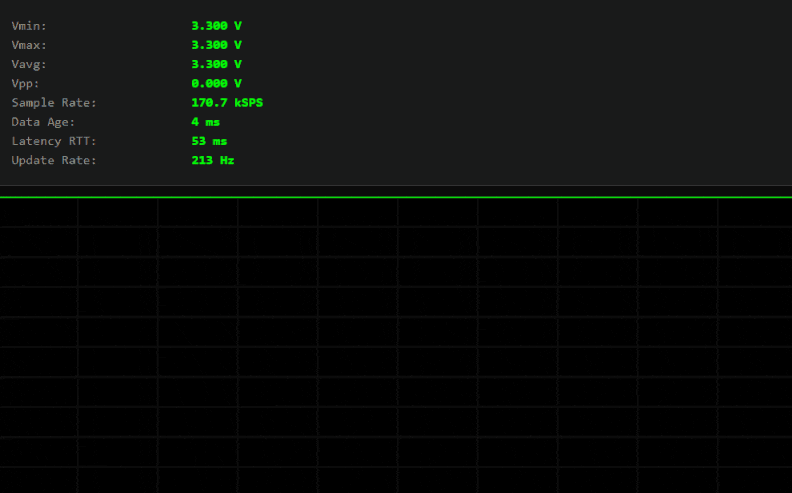
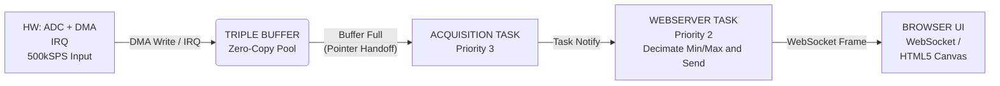

# Picoscope - Pico 2 W Wi-Fi Oscilloscope

> A bare-metal, Wi-Fi-enabled digital oscilloscope built on the Raspberry Pi Pico 2 W. This project streams ADC data at 500 kSPS to a web-based UI over WebSocket with sub-10ms latency using a zero-copy, lock-free, triple-buffered architecture running on FreeRTOS.



## Core Technologies

- **MCU:** Raspberry Pi Pico 2 W (RP2350)
- **Language:** C (C11), CMake
- **RTOS:** FreeRTOS (using Task Notifications, priority-based scheduling)
- **Core Concepts:** Bare-Metal Programming, Real-Time Systems, DMA (Direct Memory Access), Concurrency (Lock-Free), Zero-Copy Buffering, Interrupt Handling (ISR)
- **Networking:** lwIP, WebSockets, Mongoose Embedded Web Server
- **Frontend:** HTML5 Canvas, JavaScript

## Key Features

This project demonstrates a high-performance, real-time data pipeline on a constrained microcontroller. The entire acquisition path is deterministic and separated from the networking stack.

- **High-Throughput DMA:** ADC + DMA to achieves 500 kSPS continuous sampling with zero CPU load during capture.
- **Zero-Copy Architecture:** Uses a triple-buffer system where the DMA controller writes directly into buffers. Buffer ownership is passed between tasks via pointers, eliminating memcpy operations from the critical path.
- **Real-Time RTOS Design:** Runs on bare-metal FreeRTOS with multiple tasks using priority-based preemptive scheduling.
- **Low-Latency Task Synchronization:** Uses FreeRTOS Task Notifications instead of queues for sub-millisecond handoff from the acquisition task to the web task.
- **Live Web Dashboard:** Streams data to a browser-based UI over WebSocket, displaying the live waveform some key metrics.

## Architecture Overview

### The DMA → Task → WebSocket Pipeline


#### <ins>1. ADC + DMA</ins>

- ADC samples at 500 kSPS (ADC clock / divider)
- DMA fills 4096-sample buffers in the background
- DMA IRQ marks buffer `FULL`, advances to next buffer (`EMPTY` or reuse if overrun)

#### <ins>2. Acquisition Task</ins>

- Polls for `FULL` buffers via `bAdcDmaGetLatestBufferPtr()` (sets state to `PROCESSING`)
- Publishes buffer pointer to `scope_data` module (zero-copy handoff)
- Releases buffer back to DMA when consumer is done via `vAdcDmaReleaseBuffer()` (sets state to `EMPTY`)

#### <ins>3. WebServer Task</ins>

- Blocks on `ulTaskNotifyTake()` with 50ms timeout (20 FPS fallback)
- Wakes immediately when acquisition task calls `xTaskNotifyGive()` (notification-based push)
- Fetches latest buffer, decimates 4096 → 256 samples (min/max preserving), sends binary WebSocket frame
- Also services Mongoose HTTP/WebSocket stack (`mg_mgr_poll`) and handles RTT pings

#### <ins>4. Browser Frontend</ins>

- WebSocket receives binary frames: `[timestamp, age, sample_count, vmin, vmax, vavg, 256×uint16]`
- Draws waveform on HTML5 canvas with grid
- Displays live metrics and round-trip latency (ping/pong)
- Operates controls for modifying the trigger frame

### Task Notification Magic

Instead of heavyweight FreeRTOS queues or semaphores, the acquisition → web handoff uses **task notifications**:

- **Zero allocation**: notification is a single 32-bit counter in the task control block
- **Low latency**: `xTaskNotifyGive()` is ISR-safe and faster than posting to a queue
- **Backpressure-friendly**: `ulTaskNotifyTake(pdTRUE, timeout)` clears the count; if multiple notifications arrive, web task processes once per wakeup (natural rate-limiting)

This keeps the web server responsive without spinning and avoids queue overruns when the browser is slow.

## Critical Configuration & Known Quirks

### lwIP Configuration (lwipopts.h)

**Must-have settings to avoid `*** PANIC *** size > 0` during socket operations:**

```c
#define DEFAULT_ACCEPTMBOX_SIZE 32      // Critical for listen() to work
#define MEMP_NUM_NETCONN 16             // Socket connections
#define MEMP_NUM_TCP_PCB 16             // TCP control blocks
#define MEMP_NUM_TCP_PCB_LISTEN 16      // Listening sockets
#define TCPIP_MBOX_SIZE 32              // TCPIP thread mailbox
```

Without these, Mongoose's `mg_http_listen()` will panic due to insufficient mailbox space in the lwIP stack.

### FreeRTOS Heap Size

In `FreeRTOSConfig.h`:

```c
#define configTOTAL_HEAP_SIZE (256*1024)   // Increase heap size for required for tasks + lwIP + Mongoose
#define configCHECK_FOR_STACK_OVERFLOW 2   // Enable stack overflow detection
#define configUSE_MALLOC_FAILED_HOOK 1     // Catch OOM early
```

## Roadmap: Future Features

- [x] Trigger Engine
- [] Advanced Measurements
- [] Multi-Channel & AC Coupling
- [] Full Frontend UI
- [] Persistence & Storage
- [] Performance Tuning

## Building

```bash
mkdir build
cd build
cmake ..
make -j$(nproc)
```

## Flashing

Hold BOOTSEL while plugging in the Pico 2 W, then:

```bash
cp picoscope.uf2 /path/to/RPI-RP2
```

Or use picotool:

```bash
picotool load picoscope.uf2
picotool reboot
```

## Usage

1. Flash the firmware
2. Connect via USB serial (115200 baud) to see debug output and IP address
3. The Pico will connect to your WiFi network (SSID/password hardcoded in `picoscope.c`)
4. Note the IP address printed: `IP Address: 192.168.1.xxx`
5. Open a browser and navigate to `http://192.168.1.xxx`
6. You should see the live oscilloscope UI with waveform and metrics
7. The onboard LED will blink at 2Hz (visual heartbeat)

## Hardware Requirements

- Raspberry Pi Pico 2 W (RP2350)
- ADC input on GPIO26 (ADC0) –> variable frontend circuit design
- USB cable for power and serial debug

## Software Requirements

- Pico SDK v2.1.0 or later
- FreeRTOS-Kernel (bundled)
- CMake 3.13+
- ARM GCC toolchain (arm-none-eabi-gcc 10.3+)
- Mongoose embedded web server (bundled in `third_party/`)

## CMakeLists.txt Configuration

**Key library linking:**

Use `pico_cyw43_arch_lwip_sys_freertos` (not `threadsafe_background`) for proper FreeRTOS integration with lwIP.

---

## References

Some key references and inspirations for this project:

- [Scoppy - An oscilloscope and logic analyzer powered by an Android device and Raspberry Pi Pico](https://github.com/fhdm-dev/scoppy)
- [XYZs of Oscilloscopes Primer by Tektronix](https://download.tek.com/document/03W_8605_7_HR_Letter.pdf)
- [AWG with Raspberry Pi Pico on Autodesk Instructables](https://www.instructables.com/Arbitrary-Wave-Generator-With-the-Raspberry-Pi-Pic/)
- ['Dr Jon EA: Pico & Pico 2' on YouTube for his series on FreeRTOS](https://www.youtube.com/@DrJonEA)
