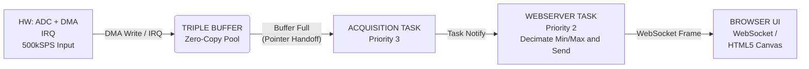

# PicoScope: Networked Real-Time Oscilloscope (RTOS + DMA)

> A high-performance, WiFi enabled oscilloscope implemented on the Raspberry Pi Pico 2 W.
> Designed to demonstrate **hard real-time data acquisition** running concurrently with a **non-deterministic network stack**.

## Project Overview

High-frequency analog signals are captured via hardware acceleration (DMA) to minimize CPU interrupts, while a FreeRTOS-managed TCP/IP stack serves a real-time visualization to a web client.

**Core Technologies:**

* **MCU:** RP2350
* **OS:** FreeRTOS
* **Networking:** Mongoose Web Server
* **Interface:** Websockets based Frontend (HTML/JS)

## System Architecture



### 1. The Producer

* **ADC Driver:** Configured for multiple sample rates up to **500 kS/s]**.
* **DMA Engine:** Offloads data transfer from the ADC FIFO to memory buffers without waking the CPU.
* **Trigger Logic:** Implements rising/falling edge detection on the raw buffer stream.

### 2. The Consumer

* **FreeRTOS Tasks:**
    * `vBlinkTask`: Simple visual heartbeat.
    * `vAcquisitionTask`: Captures latest data from ADC via DMA then passes to ScopeData.
    * `vWebServerTask`: Manages the LwIP context and Mongoose event loop.
* **Concurrency:** Uses **Task Notifications** to synchronize the capture-complete events with the data transmission logic, ensuring the WiFi stack never blocks the acquisition task.

## Key Features

* **Zero-Copy Capture:** CPU utilization is near-zero during the sampling phase due to DMA integration.
* **Wireless Visualization:** Hosted web server allows viewing the output on any device (Phone/Laptop/Tablet).
* **Configurable Triggering:** Software-defined trigger levels and timebase control.

## Build & Flash

*Dependencies: CMake, Arm-GCC Toolchain, Pico-SDK*

```bash
mkdir build && cd build
cmake ..
make
# Flash the .uf2 file to the Pico
```

## Demo


## References

Some references I used for this project:

- [Scoppy - An oscilloscope and logic analyzer powered by an Android device and Raspberry Pi Pico](https://github.com/fhdm-dev/scoppy)
- [XYZs of Oscilloscopes Primer by Tektronix](https://download.tek.com/document/03W_8605_7_HR_Letter.pdf)
- [AWG with Raspberry Pi Pico on Autodesk Instructables](https://www.instructables.com/Arbitrary-Wave-Generator-With-the-Raspberry-Pi-Pic/)
- ['Dr Jon EA: Pico & Pico 2' on YouTube for his series on FreeRTOS](https://www.youtube.com/@DrJonEA)
