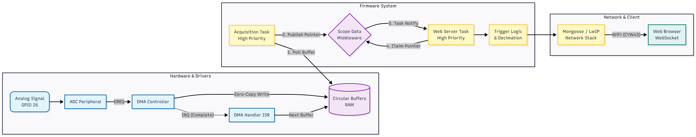
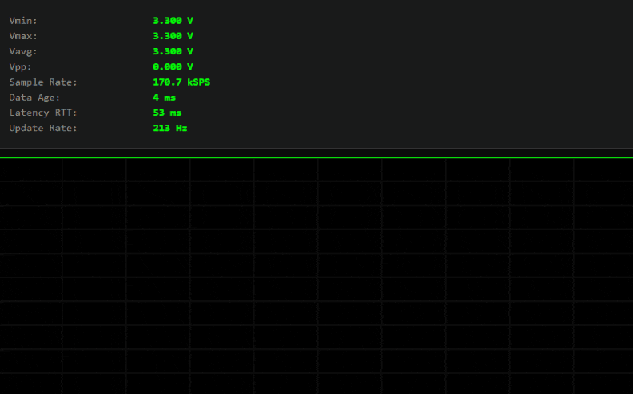

# MemStream-RTOS: A Zero-Copy, DMA-Accelerated Hardware-to-Network Streaming Engine for RP2350

> A high-performance, asynchronous data streaming framework implemented on the Raspberry Pi Pico 2 W (RP2350). Designed to demonstrate **hard real-time data acquisition** running concurrently with a **non-deterministic network stack**.


## Project Overview
High-frequency analog signals are captured via hardware acceleration (DMA) to minimize CPU interrupts, while a FreeRTOS-managed TCP/IP stack serves a real-time visualization to a web client.

- **Real-Time OS:** Powered by FreeRTOS with Symmetric Multiprocessing (SMP) support for dual-core execution.
- **Hardware Acceleration:** Uses a DMA engine to offload high-bandwidth data transfers, maintaining near-zero CPU overhead during acquisition.
- **Concurrent Networking:** Integrates a Mongoose-based web server to provide a real-time WebSocket stream to remote clients.

## System Architecture



1. The Producer (Hardware Interface)
- **DMA-Driven Acquisition:** The ADC is configured to stream directly into memory buffers without CPU intervention.
- **Deterministic Timing:** Capable of hardware-governed sample rates up to 500 kS/s, ensuring data integrity regardless of network load.

2. The Consumer (Network Interface)
- **Task Synchronization:** Uses FreeRTOS Task Notifications to trigger the transmission logic immediately upon buffer completion.
- **Zero-Copy Pipeline:** Data is published directly from DMA-filled buffers to the network stack, eliminating expensive memory-to-memory copies.

## Key Features

- **Multithreaded Execution:** Managed via specialized FreeRTOS tasks including `vAcquisitionTask` (high priority), `vWebServerTask` (network handling), and `vBlinkTask` (system heartbeat).
- **Advanced Memory Management:** Features a custom 256KB heap configuration and dedicated stack allocations for each task to handle high-concurrency workloads.
- **Event-Driven Architecture:** Leverages an asynchronous Mongoose event loop to manage LwIP contexts and WebSocket traffic.

## Build & Flash

*Dependencies: CMake, Arm-GCC Toolchain, Pico-SDK*

```bash
mkdir build && cd build
cmake ..
make
# Flash the  .uf2 to the Raspberry Pi Pico 2 W
```

## Demo



## References

Some references I used for this project:

- [Scoppy - An oscilloscope and logic analyzer powered by an Android device and Raspberry Pi Pico](https://github.com/fhdm-dev/scoppy)
- [XYZs of Oscilloscopes Primer by Tektronix](https://download.tek.com/document/03W_8605_7_HR_Letter.pdf)
- [AWG with Raspberry Pi Pico on Autodesk Instructables](https://www.instructables.com/Arbitrary-Wave-Generator-With-the-Raspberry-Pi-Pic/)
- ['Dr Jon EA: Pico & Pico 2' on YouTube for his series on FreeRTOS](https://www.youtube.com/@DrJonEA)
